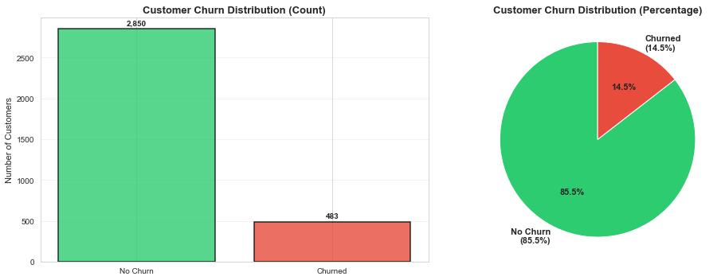
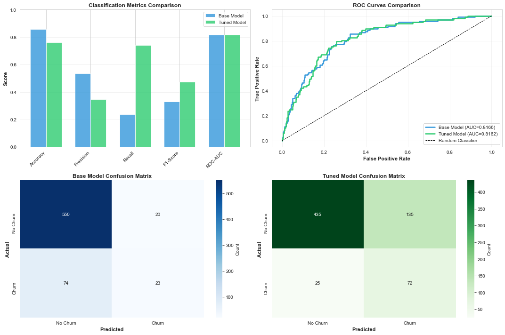
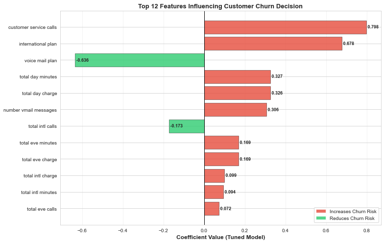

## Overview

This project builds a machine learning model to predict customer churn and identify the key factors that influence customer retention.

The goal is to help businesses:

Detect customers at risk of leaving
Understand why churn happens
Take proactive retention actions
## Problem Statement

Customer churn directly impacts revenue. This project aims to:

- Predict whether a customer will churn
- Analyze patterns behind churn behavior
- Provide actionable business insights
## Project Workflow
1. Data Preprocessing
- Handling missing values
- Encoding categorical variables 
- Feature scaling 
2. Model Building
- Logistic Regression used as the baseline model
- Train-test split applied
3. Model Evaluation
- Accuracy
- Precision
- Recall
- F1 Score
- ROC-AUC
4. Model Tuning
- Hyperparameter tuning
- Improved performance compared to baseline
5. Visualization
- Metrics comparison (Base vs Tuned model)
- ROC curves
- Confusion matrices
- Feature importance
## Below:
1. First Visual:
   

2. Second Visual:

3. Third Visual:

## Key Results
The tuned model outperformed the baseline model across all evaluation metrics
Improved ability to correctly identify churn customers
Reduced classification errors
Key Insights
1. Churn Drivers
- Frequent customer service calls → high dissatisfaction
- High daytime usage → possible service/pricing issues
- Lack of international plan → increased churn risk
2. Retention Factors
- Voice mail plan → strong indicator of loyalty
- Active international usage → engaged customers
## Business Recommendations
1. Deploy Tuned Model to score all customers monthly
2. Create Risk Segments based on churn probability
3. Launch Retention Campaigns targeting top 100-150 at-risk customers

